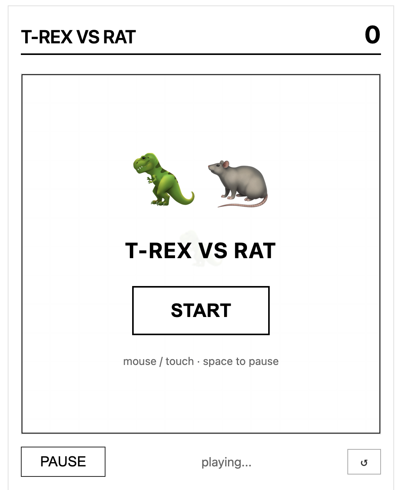

# 🦖 T-REX VS RAT



A minimalist browser game where **T-Rex (🦖) eats small dinos (🦕) but is afraid of rats (🐀)**.  
Inspired by the classic "elephant afraid of mouse" paradox.

🎮 **Play now**: [https://yourusername.github.io/dino-rat-game/](https://yourusername.github.io/dino-rat-game/)

---

## ✨ Features

- **Minimalist Design** - Clean black & white interface, only rats are red
- **Local Leaderboard** - Top 10 scores saved in your browser
- **Pause Function** - Click PAUSE button or press spacebar
- **Mobile Friendly** - Touch controls on phones and tablets
- **No Ads, No Tracking** - Pure HTML/CSS/JavaScript

## 🎯 How to Play

| Control | Action |
|---------|--------|
| 🖱️ Mouse (desktop) | Move T-Rex |
| 👆 Touch (mobile) | Slide finger to move T-Rex |
| ␣ Spacebar | Pause/Resume |
| ⏸️ PAUSE button | Pause/Resume |

### Game Rules

- **🦖 T-Rex (you)** - Move to eat small dinos
- **🦕 Small Dino** - Eat for +1 point
- **🐀 Rat** - Game over on contact (T-Rex is afraid!)

## 🏆 Leaderboard

- Scores are automatically saved after each game
- Top 3 scores get 🥇🥈🥉 medals
- Data stored in your browser's localStorage (never leaves your device)
- Click CLEAR to reset leaderboard

## 📸 Screenshots

| Gameplay | Game Over |
|----------|-----------|
| (Add screenshot 1) | (Add screenshot 2) |

## 🚀 Quick Start

```bash
# Clone repository
git clone https://github.com/yourusername/dino-rat-game.git

# Open in browser
cd dino-rat-game
open index.html